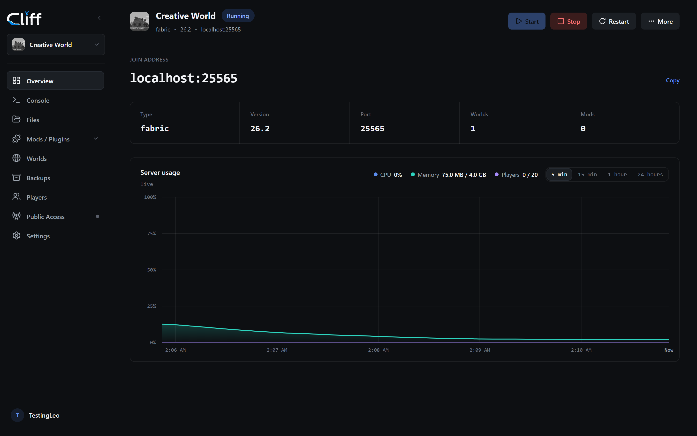
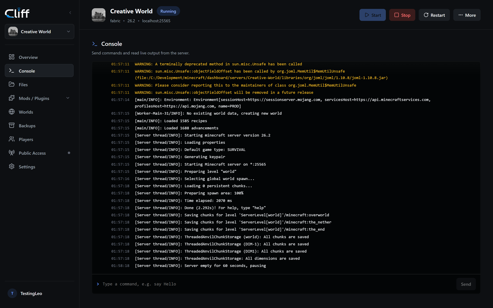
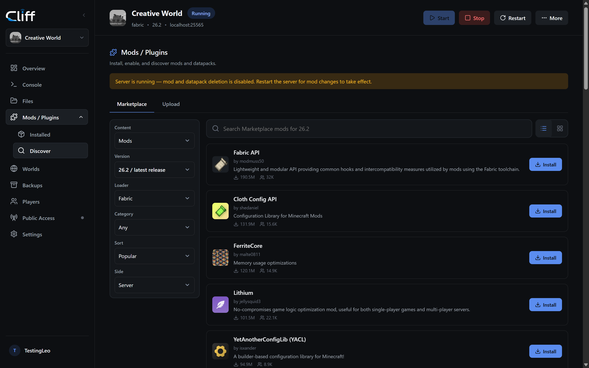
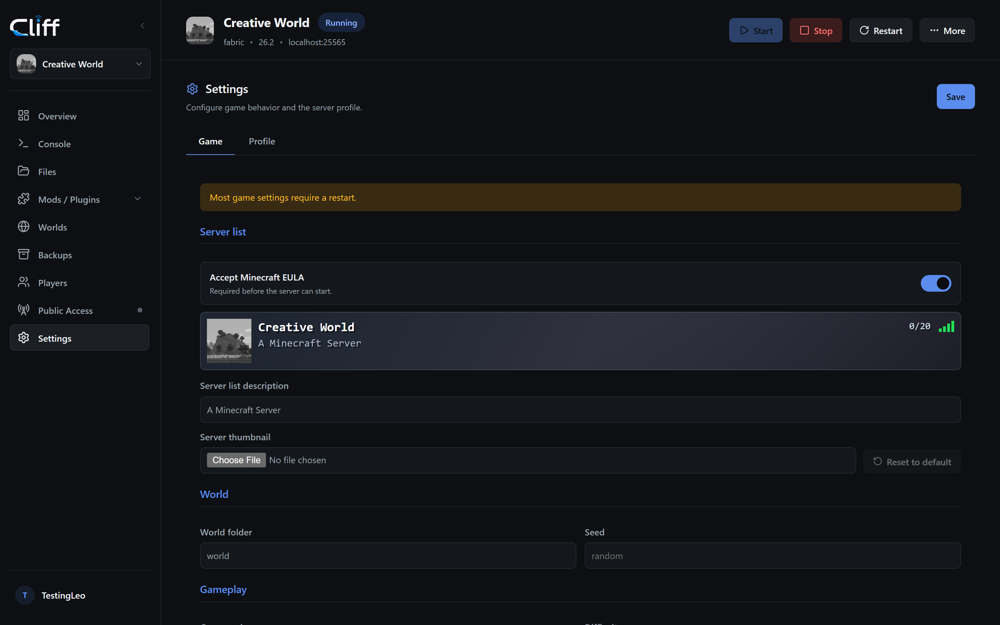
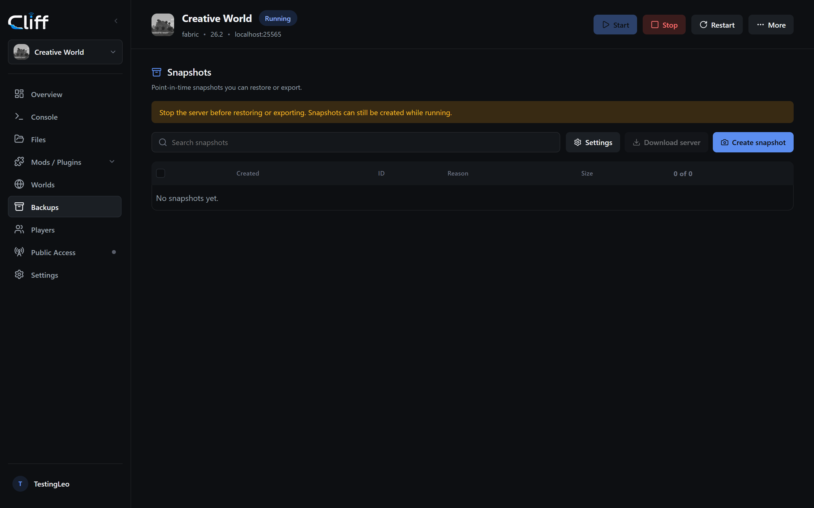
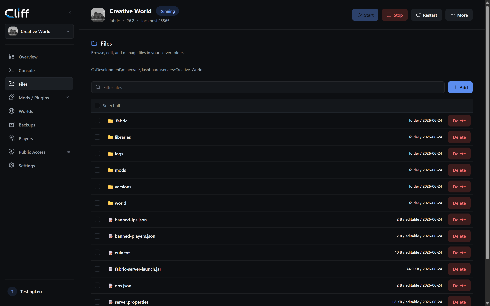
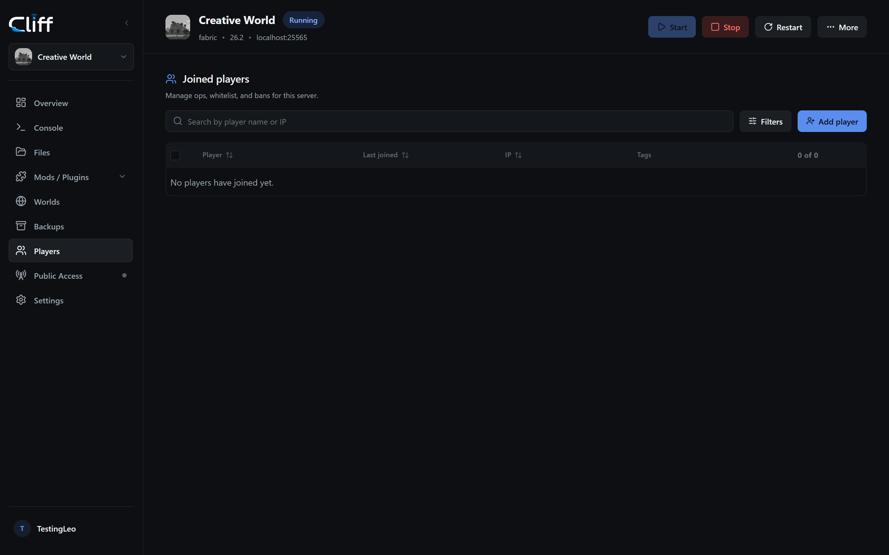
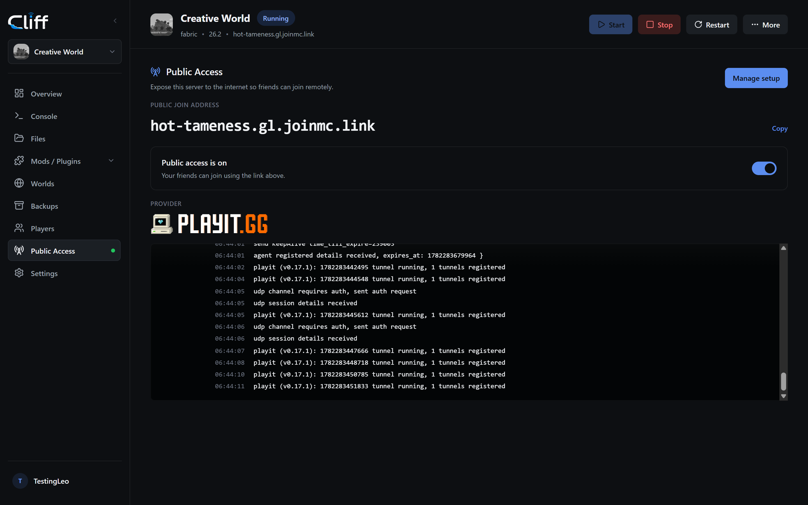
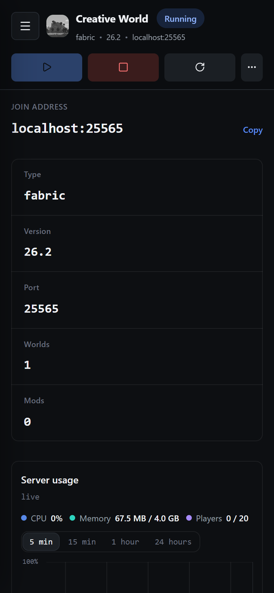

<div align="center">


### 🚀 The BEST way to host Minecraft servers on your VPS or home lab.

A self-hosted, blazing-fast web dashboard for managing Minecraft Java servers. No cloud. No subscription. No external dependencies. Just you, your hardware, and a dashboard that actually feels good to use.

[](https://github.com/W1seGit/Cliff/actions/workflows/build.yml)
[](https://github.com/W1seGit/Cliff/releases)
[](https://github.com/W1seGit/Cliff/blob/main/LICENSE)
[](https://github.com/W1seGit/Cliff/commits/main)
[](#supported-platforms)

</div>

---

## 📸 Screenshots

<table>
<tr>
<td align="center" width="33%"><br><b>Dashboard</b></td>
<td align="center" width="33%"><br><b>Live Console</b></td>
<td align="center" width="33%"><br><b>Mod & Plugin Browser</b></td>
</tr>
<tr>
<td align="center" width="33%"><br><b>Server Settings</b></td>
<td align="center" width="33%"><br><b>Backups</b></td>
<td align="center" width="33%"><br><b>File Browser</b></td>
</tr>
<tr>
<td align="center" width="33%"><br><b>Player Management</b></td>
<td align="center" width="33%"><br><b>Public Access</b></td>
<td align="center" width="33%"><br><b>Mobile</b></td>
</tr>
</table>

---

## ✨ Features

- **Server management** — import, create, clone, start/stop Vanilla, Paper, Purpur, Folia, Fabric, Forge, and NeoForge servers
- **Live console** — WebSocket streaming with command input, presets, and log download
- **Mod & plugin management** — install, search, and bulk manage mods/plugins via Modrinth and CurseForge
- **Worlds & datapacks** — switch worlds, import, rename, delete with snapshot protection
- **Player access** — ops, whitelist, bans with Mojang UUID lookup and live player heads
- **Backups** — automatic snapshots before risky actions, manual snapshots, restore, and retention cleanup
- **File browser** — upload, download, edit configs/JSON/YAML/TOML
- **Responsive UI** — dark theme that works on desktop and mobile
- **Public access** — optional playit.gg and Minekube integrations
- **Zero dependencies** — no Docker, no Node runtime in production, no external database. Single ~13 MB binary.

---

## 🚀 Quick Links

| 📖 Documentation | 💬 Discord |
| :---: | :---: |
| [](https://docs.cliff.gg) | [](https://discord.cliff.gg) |
| Installation guides, configuration tutorials, and API reference | Get help from the community and development team |

---

## 📥 Install

### One-command install

**Windows (PowerShell):**
```powershell
irm getcliff.dev/install.ps1 | iex
```

**macOS / Linux:**
```bash
curl -fsSL getcliff.dev/install.sh | sh
```

That's it. The installer downloads the prebuilt binary, starts the daemon, and prints your dashboard URL. Use `-p <port>` to install on a custom port:

```powershell
irm getcliff.dev/install.ps1 | iex -- -p 8081
```
```bash
curl -fsSL getcliff.dev/install.sh | sh -s -- -p 8081
```

### From a prebuilt package

Download a `cliff-<version>-<platform>-<arch>.zip` from [releases](https://github.com/W1seGit/Cliff/releases), extract it, and run:

**Windows:**
```powershell
powershell -ExecutionPolicy Bypass -File .\run.ps1
```

**macOS / Linux:**
```bash
sh ./run.sh
```

### ⚡ After installing

1. Open `http://localhost:8080` in your browser (or `http://<your-server-ip>:8080` from another device on the same network)
2. Create a local admin account on first visit
3. Import an existing server folder/ZIP or create a new one from the dashboard
4. Hit start — you're running

---

## 💻 Supported Platforms

| Platform | Architecture |
|----------|-------------|
| Windows | x86_64 (amd64) |
| Linux | x86_64 (amd64) |
| Linux | ARM64 |
| macOS | Intel (amd64) |
| macOS | Apple Silicon (arm64) |

---

## 📦 Build Size

Cliff ships as a single self-contained binary with embedded static web assets. No runtime dependencies.

| Component | Size |
|-----------|------|
| Daemon binary (Go, stripped) | ~12 MB |
| Static web assets (dashboard) | ~1.4 MB |
| **Total packaged** | **~13 MB** |

### Runtime usage (idle)

| Metric | Value |
|--------|-------|
| RAM | ~13 MB |
| CPU | < 1% |
| Threads | ~19 |

---

## 📊 Code Statistics

| Extension | Files | Lines |
| --- | ---: | ---: |
| `.go` | 35 | 14,014 |
| `.tsx` | 61 | 9,547 |
| `.css` | 30 | 7,456 |
| `.ts` | 6 | 949 |
| `.js` | 26 | 248 |
| **Total** | **158** | **32,214** |

---

## 🤝 Contributing

We welcome contributions! Check out [CONTRIBUTING.md](CONTRIBUTING.md) to get started.

---

## 📄 License

This project is licensed under the [GNU General Public License v3](LICENSE).

---

<div align="center">

**Made with ❤️ by the Cliff Team**

[Releases](https://github.com/W1seGit/Cliff/releases) • [Issues](https://github.com/W1seGit/Cliff/issues) • [Stargazers](https://github.com/W1seGit/Cliff/stargazers)

</div>
